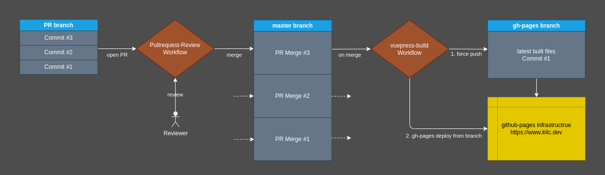

# ocelot.social

This repository contains the https://www.ocelot.social Website utilizing `vuepress` to generate it.

## Software requirements

This package requires:
- [nodejs](https://github.com/nodejs/node)
- [npm](https://github.com/npm/cli)

## Techstack

This package uses:
- [vuepress](https://github.com/vuejs/vuepress)
- [vuepress-theme-book](https://github.com/cyrilf/vuepress-theme-book)
- [vuepress-deploy](https://github.com/jenkey2011/vuepress-deploy)

## Usage

How to use this package

### Build

Build the static files of the website which then can be found under `docs/.vuepress/dist/`.
```
npm run build
```

### Dev

Bring up a development environment with hot reloading which can be reached under http://localhost:8080/

```
npm run dev
```

### Test

Run the tests to ensure everything is working as expected

```
npm test
```

## How it works

This repository utilizes `vuepress-deploy` to automatically deploy the current `master` branch to github pages.



A Pullrequest-Review-Workflow is applied to get changes into the `master`. From there on an automatic github workflow script utilizing `vuepress-deploy` is taking over. The vuepress page is built and force-pushed to the `gh-pages` branch, which in turn is then deployed on the github pages infrastructure and bound to the web address [IT4C.dev](https://www.it4c.dev).
