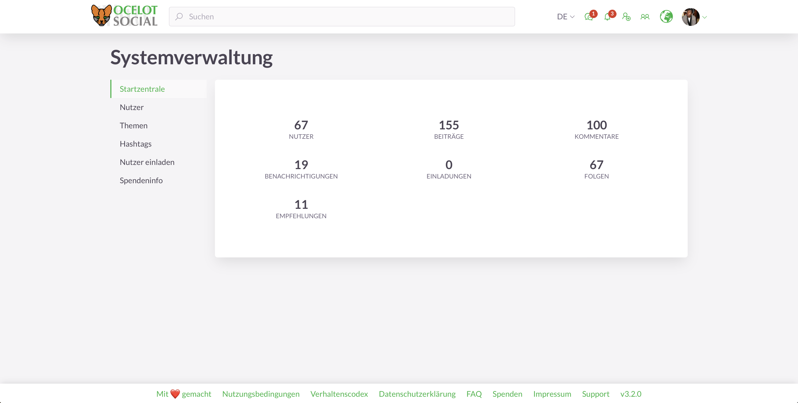

<!-- markdownlint-disable no-inline-html first-line-heading -->

  

    

      
      

        Freie Open-Source-Software
        für dein soziales Netzwerk
      

      <a href="#benefits">
        <Button class="hero-button">
          Entdecke mehr
        </Button>
      </a>
    

  

<h2 id="benefits" class="large-header">Warum ocelot.social?</h2>

  <figure>
    <VPIcon icon="fa-solid fa-face-smile fa-fw fa-sm" />
    <figcaption>
      <h3>Freie Open-Source-Software</h3>
      Du kannst die Software nutzen und weiterentwickeln.
    </figcaption>
  </figure>
  <figure>
    <VPIcon icon="fa-solid fa-people-group fa-fw fa-sm" />
    <figcaption>
      <h3>Für alle</h3>
      <i>Ocelot.social</i> eignet sich für die Zivilgesellschaft sowie für staatliche und private Organisationen.
    </figcaption>
  </figure>
  <figure>
    <VPIcon icon="fa-solid fa-filter fa-fw fa-sm" />
    <figcaption>
      <h3>Selbstbestimmtes Filtern</h3>
      Du wählst selber, welchen Inhalt du siehst – keine undurchschaubare Auswahl.
    </figcaption>
  </figure>
  <figure>
    <VPIcon icon="fa-solid fa-gears fa-fw fa-sm" />
    <figcaption>
      <h3>Konfigurierbar</h3>
      Als Betreiber kannst du das Design und die Funktionen nach deinen Wünschen einstellen.
    </figcaption>
  </figure>
  <figure>
    <VPIcon icon="fa-solid fa-code fa-fw fa-sm" />
    <figcaption>
      <h3>Erweiterbar</h3>
      Neue Funktionen können hinzuprogrammiert werden, die allen zugute kommen.
    </figcaption>
  </figure>
  <figure>
    <VPIcon icon="fa-solid fa-up-right-and-down-left-from-center fa-fw fa-sm" />
    <figcaption>
      <h3>Skalierbar</h3>
      Dank neuster Technik kannst du die Software für alle Netzwerkgrößen einsetzen.
    </figcaption>
  </figure>
  <figure>
    <VPIcon icon="home fa-fw fa-sm" />
    <figcaption>
      <h3>Flexibles Hosting</h3>
      Du kannst dein Netzwerk selber hosten oder von deinem Dienstleister hosten lassen.
    </figcaption>
  </figure>
  <figure>
    <VPIcon icon="fa-solid fa-scale-balanced fa-fw fa-sm" />
    <figcaption>
      <h3>Deine eigenen Regeln</h3>
      Bestimme die Nutzungsbedingungen für dein Netzwerk selber.
    </figcaption>
  </figure>
  <figure>
    <VPIcon icon="fa-solid fa-shuttle-space fa-fw fa-sm" />
    <figcaption>
      <h3>Neueste Technologie</h3>
      Die Software ist technologisch am Puls der Zeit – flexibel, zuverlässig, performant.
    </figcaption>
  </figure>

<h2 id="feature-headline" class="large-header">Wichtigste Funktionen</h2>

  <figure>
    
    <figcaption>
      Login
    </figcaption>
  </figure>
  <figure>
    
    <figcaption>
      Beitragsübersicht (Newsfeed)
    </figcaption>
  </figure>
  <figure>
    
    <figcaption>
      Einzelner Beitrag
    </figcaption>
  </figure>
  <figure>
    
    <figcaption>
      Einzelne Veranstaltung
    </figcaption>
  </figure>
  <figure>
    
    <figcaption>
      Nutzerprofil
    </figcaption>
  </figure>
  <figure>
    
    <figcaption>
      Einstellungen des Nutzerkontos
    </figcaption>
  </figure>
  <figure>
    
    <figcaption>
      Gruppenübersicht
    </figcaption>
  </figure>
  <figure>
    
    <figcaption>
      Gruppenprofil
    </figcaption>
  </figure>
  <figure>
    
    <figcaption>
      Eins-zu-Eins-Chat
    </figcaption>
  </figure>
  <figure>
    
    <figcaption>
      Benachrichtigungen
    </figcaption>
  </figure>
  <figure>
    
    <figcaption>
      Landkarte
    </figcaption>
  </figure>
  <figure>
    
    <figcaption>
      Mehrsprachigkeit
    </figcaption>
  </figure>
  <figure>
    
    <figcaption>
      Moderation
    </figcaption>
  </figure>
  <figure>
    
    <figcaption>
      Systemverwaltung
    </figcaption>
  </figure>

  <a href="/de/features/">
    <Button>
      Alle Funktionen ansehen
    </Button>
  </a>

<!-- <h2 id="why-foss" class="large-header">Warum freie Open-Source-Software?</h2>

  <figure>
    <VPIcon icon="fa-solid fa-fw fa-sm" />
    <figcaption>
      <h3>Frei verfügbar</h3>
      Freie Software ist für jeden Menschen jederzeit zugänglich. Dass Lizenzen ablaufen, gibt es nicht.
    </figcaption>
  </figure>
  <figure>
    <VPIcon icon="fa-solid fa-fw fa-sm" />
    <figcaption>
      <h3>Transparent</h3>
      Bei freier Software ist der Quellcode einsehbar. Jeder Mensch hat so die Möglichkeit nachzusehen, was im Hintergrund eines Programmes passiert.
    </figcaption>
  </figure>
  <figure>
    <VPIcon icon="fa-solid fa-fw fa-sm" />
    <figcaption>
      <h3>Kopierbar</h3>
      Ich kann jederzeit mit allen meinen Kolleginnen und Kollegen zusammenarbeiten. Alle können es jederzeit verwenden, ohne Einschränkungen.
    </figcaption>
  </figure>
  <figure>
    <VPIcon icon="fa-solid fa-fw fa-sm" />
    <figcaption>
      <h3>Veränderbar</h3>
      Jede Person kann etwas zu ihrem Lieblingsprogramm beitragen, jederzeit. Ich kann das Programm so verwenden, wie ich es am liebsten will.
    </figcaption>
  </figure>

 -->

<h2 class="large-header">Probier es aus</h2>

<!--
| E-Mail                  | Passwort | Benutzerrolle   |
| :---                    | :---     | :---            |
| `user@example.org`      | 1234     | normaler Nutzer |
| `moderator@example.org` | 1234     | Moderator       |
| `admin@example.org`     | 1234     | Administrator   |
-->

  

    Teste die Live-Demo auf
    <a href="https://stage.ocelot.social" target="_blank">https://stage.ocelot.social</a>
    mit den folgenden Zugangsdaten:
  

  <table>
    <thead>
      <tr>
        <th style="text-align:left;">E-Mail</th>
        <th style="text-align:left;">Passwort</th>
        <th style="text-align:left;">Benutzerrolle</th>
      </tr>
    </thead>
    <tbody>
      <tr>
        <td style="text-align:left;"><code>user@example.org</code></td>
        <td style="text-align:left;">1234</td>
        <td style="text-align:left;">normaler Nutzer</td>
      </tr>
      <tr>
        <td style="text-align:left;"><code>moderator@example.org</code></td>
        <td style="text-align:left;">1234</td>
        <td style="text-align:left;">Moderator</td>
      </tr>
      <tr>
        <td style="text-align:left;"><code>admin@example.org</code></td>
        <td style="text-align:left;">1234</td>
        <td style="text-align:left;">Administrator</td>
      </tr>
    </tbody>
  </table>

<h2 class="large-header">Loslegen</h2>

  

    <i>Ocelot.social</i> kannst du auf einem eigenen Server hosten oder es hosten lassen. 
    Schau dir an, welche Möglichkeiten es gibt:
  

  <a href="/de/get-started/">
    <Button>
      Los geht’s
    </Button>
  </a>

<!-- ## Testimonials

XXX -->

<MiniBlog
  :title="'Neueste Beiträge'"
  :readMoreLinkTitle="'Weiterlesen'"
  :show-all-posts-button-title="'Alle Beiträge ansehen'"
/>

<h2 class="large-header">Spenden</h2>

  

    Die Software <i>ocelot.social</i> ist frei verfügbar – Instandhaltung und Weiterentwicklung kosten hingegen Geld. 
    Hilf uns mit deiner Spende:
  

  <a href="/de/donate/">
    <Button class="donate-button">
      Hier spenden
    </Button>
  </a>

<h2 class="large-header">Kontakt</h2>

  

    Hast du Fragen, Anregungen oder Wünsche, nehme gerne <a href="/de/contact/">Kontakt</a> mit uns auf.
  

