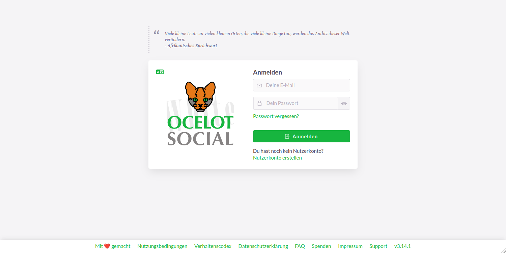
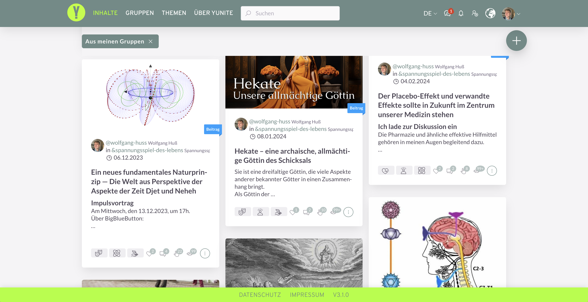
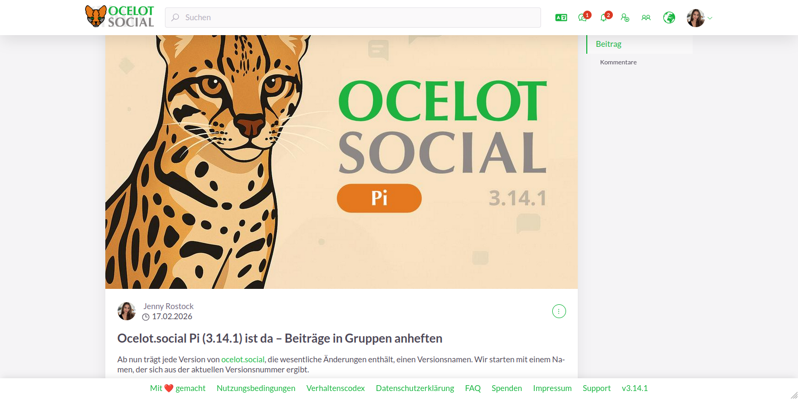
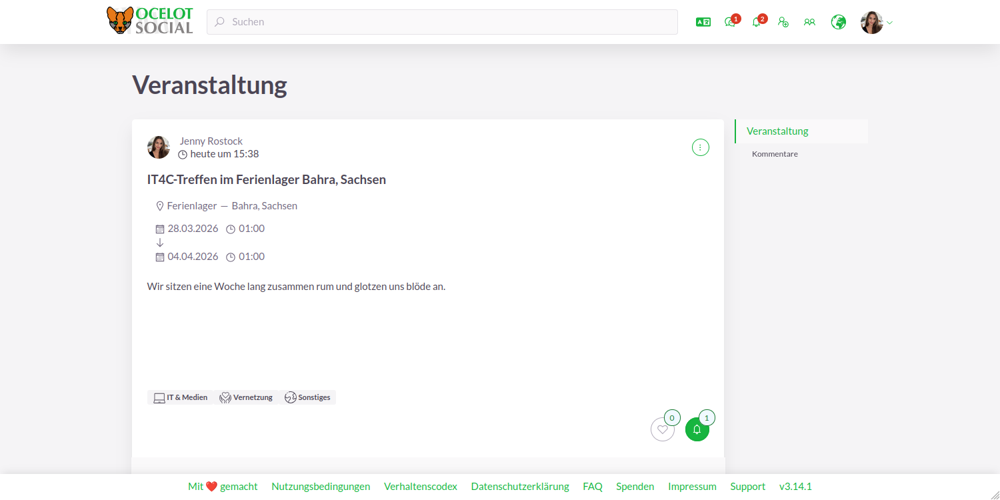
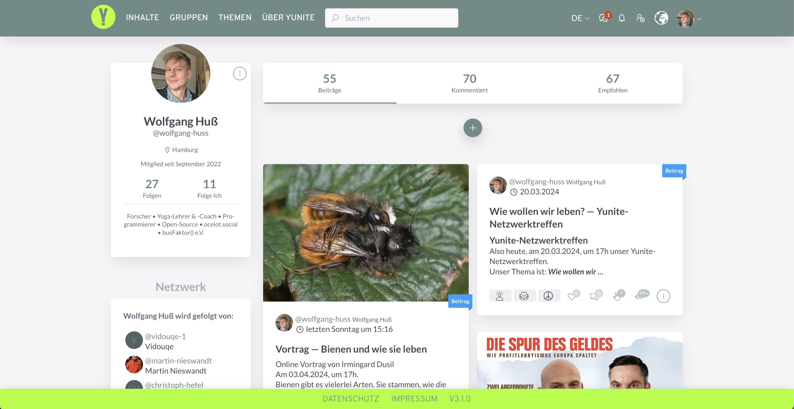
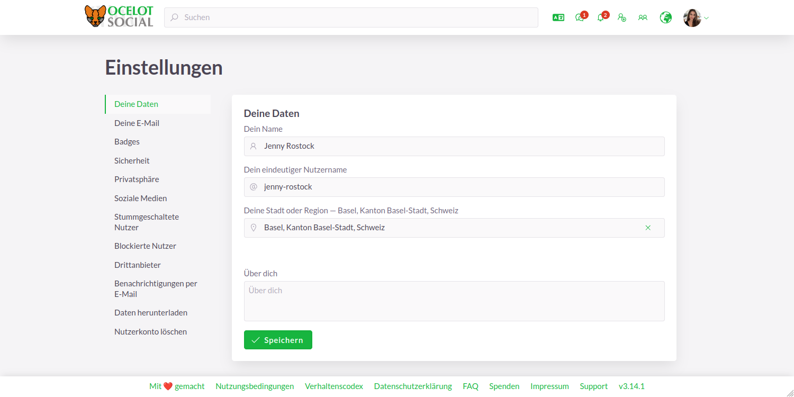
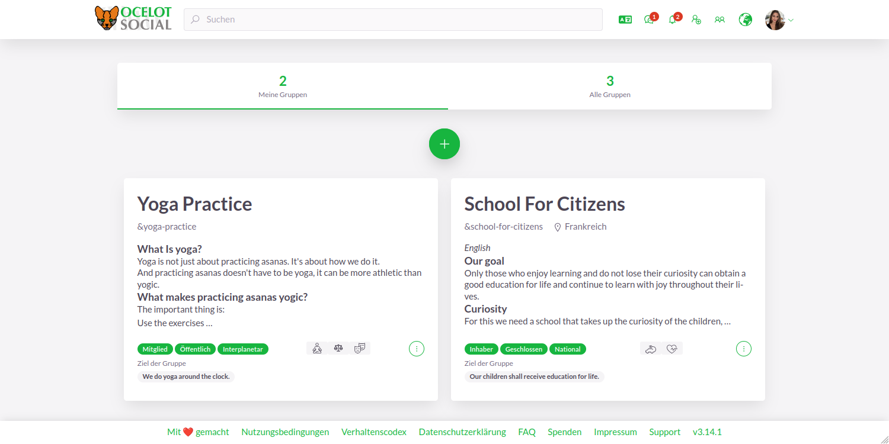
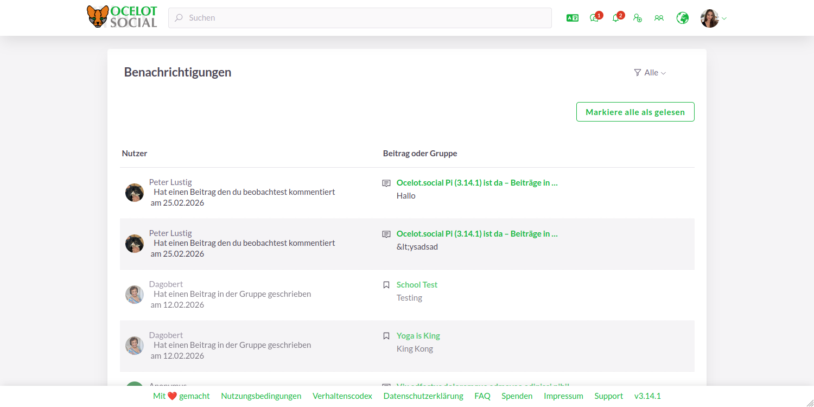

## Vorteile

Betreiber:

- Freie und Open-Source-Software
- Konfigurierbar
- Erweiterbar
- Skalierbar für alle Netzwerkgrößen
- Für alle: Zivilgesellschaft, Staat, private (auch kommerziell)
- Zum **Selber-Hosten** oder hosten lassen
- Deine eigenen Nutzungsbedingungen
- Neueste Technologie

## Screenshots

XXX

  <figure>
    
    <figcapture>
        Login
    </figcapture>
  </figure>
  <figure>
    
    <figcapture>
        Newsfeed
    </figcapture>
  </figure>
  <figure>
    
    <figcapture>
        Einzelner Beitrag
    </figcapture>
  </figure>
  <figure>
    
    <figcapture>
        Einzelne Veranstaltung
    </figcapture>
  </figure>
  <figure>
    
    <figcapture>
        Nutzerprofil
    </figcapture>
  </figure>
  <figure>
    
    <figcapture>
        Einstellungen des Nutzerkontos
    </figcapture>
  </figure>
  <figure>
    
    <figcapture>
        Gruppenübersicht
    </figcapture>
  </figure>
  <figure>
    
    <figcapture>
        Gruppenprofil
    </figcapture>
  </figure>
  <figure>
    
    <figcapture>
        Eins-zu-Eins-Chat
    </figcapture>
  </figure>
  <figure>
    
    <figcapture>
        Benachrichtigungen
    </figcapture>
  </figure>
  <figure>
    
    <figcapture>
        Landkarte
    </figcapture>
  </figure>
  <figure>
    
    <figcapture>
        Mehrsprachigkeit
    </figcapture>
  </figure>
  <figure>
    
    <figcapture>
        Moderation
    </figcapture>
  </figure>
  <figure>
    
    <figcapture>
        Systemverwaltung
    </figcapture>
  </figure>

## Hauptfunktionen

- Benutzerprofil
- Benutzerrollen: Benutzer, Moderator, Administrator
- Gruppen: öffentlich, geschlossen, versteckt
- Beitragsformen: Beitrag, Veranstaltung
- Kommentieren
- Beitragsübersicht (Newsfeed)
- Filtern und Sortieren
- Chat: Privater 1:1-Chat
- Karte
- Suche
- Benachrichtigungen
- Mehrsprachig
- Progressive Web App (PWA)

→ [Alle Funktionen ansehen](/de/features/)

## Demo

Teste die Live-Demo auf
[https://stage.ocelot.social](https://stage.ocelot.social)
mit den folgenden Zugangsdaten:

| E-Mail                  | Passwort | Benutzerrolle   |
| :---                    | :---     | :---            |
| `user@example.org`      | 1234     | normaler Nutzer |
| `moderator@example.org` | 1234     | Moderator       |
| `admin@example.org`     | 1234     | Administrator   |

## Loslegen

Möchtest du ein Netzwerk selber betreiben?

*Ocelot.social* kannst du auf einem eigenen Server hosten oder es hosten lassen.  
Schau dir an, welche Möglichkeiten es gibt:

→ [Los geht's](/de/get-started/)

<!-- ## Testimonials

XXX -->

## Spenden

Die Software des Netzwerks ist frei verfügbar – Betrieb, Unterhalt und Weiterentwicklung kosten hingegen Geld.

Der Verein [busFaktor() e.V.](https://busfaktor.org/de/) koordiniert und fördert die Programmierung von *ocelot.social*.
Unterstütze die Nachhaltigkeit  der Software und deren Netzwerke gerne mit einer Einmal- oder Dauerspende:

<a href="https://busfaktor.org/de/spenden" target="_blank">
  <Button class="md-button">
    Hier spenden
  </Button>
</a>

## Kontakt

Hast du Fragen, Anregungen oder Wünsche, nehme gerne [Kontakt](/de/contact/) mit uns auf.
