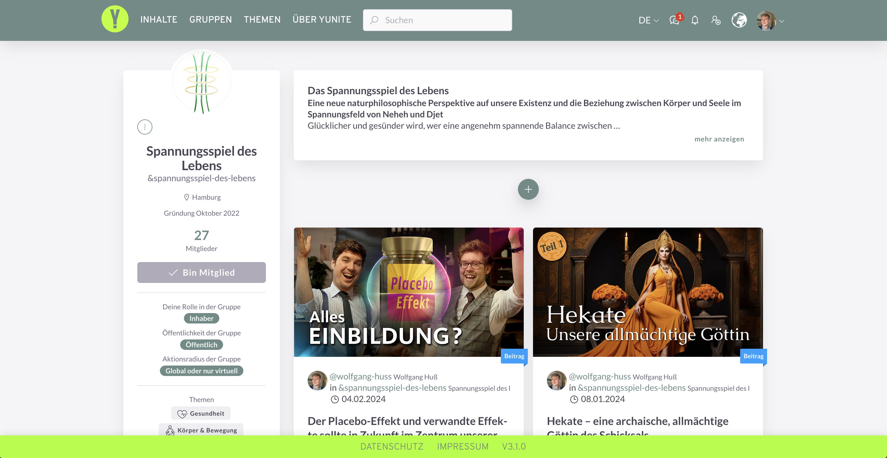
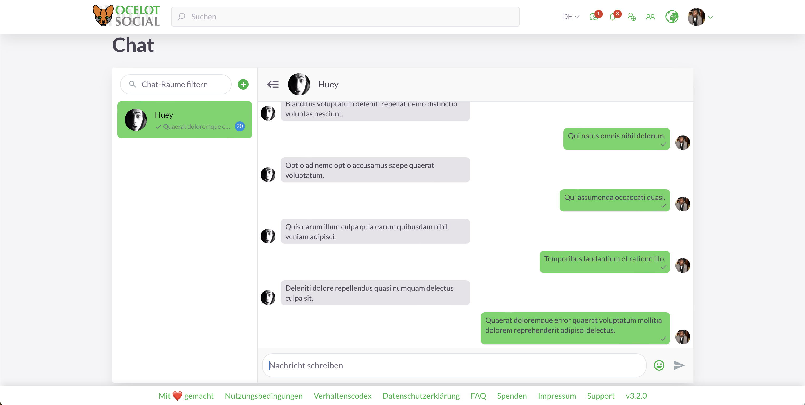
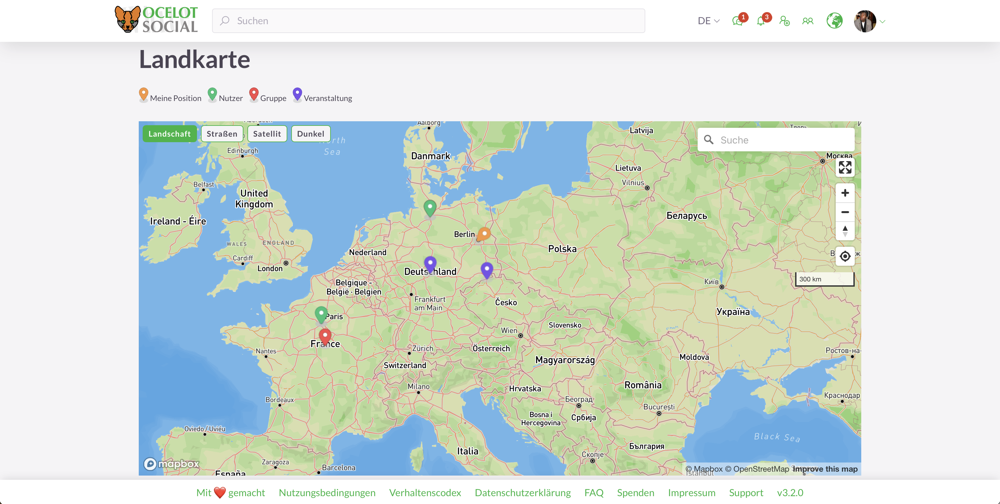
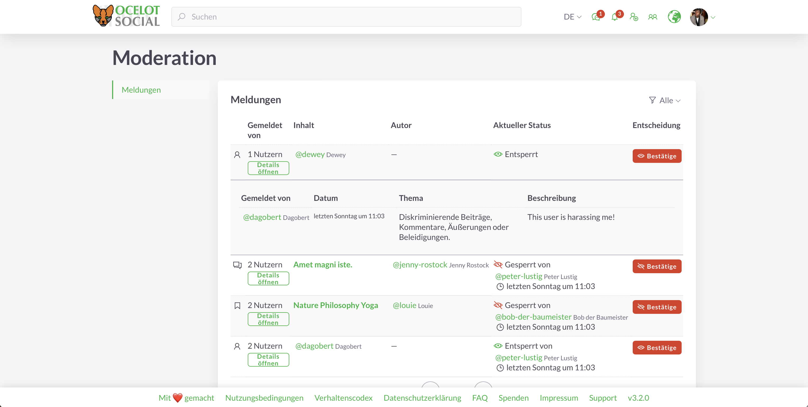

<!-- markdownlint-disable no-inline-html first-line-heading -->
<div class="hero-container">
  <div class="hero-container-inner">
    <div class="hero-container-content">
      
      <div id="slogan-container">
        <span id="slogan-1" class="slogan">Software Libre y de Código Abierto</span>
        <span id="slogan-2" class="slogan">para tu red social</span>
      </div>
      <a href="#benefits">
        <Button class="hero-button">
          Descubre más
        </Button>
      </a>
    </div>
  </div>
</div>

<h2 id="benefits" class="large-header">¿Por qué ocelot.social?</h2>

<div class="benefits-grid center">
  <figure>
    <HopeIcon icon="fa-solid fa-face-smile" />
    <figcaption>
      <h3>Software libre y de código abierto</h3>
      Puedes usar y desarrollar más el software.
    </figcaption>
  </figure>
  <figure>
    <HopeIcon icon="fa-solid fa-people-group" />
    <figcaption>
      <h3>Para todos</h3>
      <i>Ocelot.social</i> es adecuado tanto para la sociedad civil como para organizaciones públicas y privadas.
    </figcaption>
  </figure>
  <figure>
    <HopeIcon icon="fa-solid fa-filter" />
    <figcaption>
      <h3>Filtrado autodeterminado</h3>
      Tú eliges qué contenido ves – sin selecciones impenetrables.
    </figcaption>
  </figure>
  <figure>
    <HopeIcon icon="fa-solid fa-gears" />
    <figcaption>
      <h3>Configurable</h3>
      Como operador, puedes personalizar el diseño y las funciones según tus deseos.
    </figcaption>
  </figure>
  <figure>
    <HopeIcon icon="fa-solid fa-code" />
    <figcaption>
      <h3>Ampliable</h3>
      Se pueden añadir nuevas funciones que beneficien a todos.
    </figcaption>
  </figure>
  <figure>
    <HopeIcon icon="fa-solid fa-up-right-and-down-left-from-center" />
    <figcaption>
      <h3>Escalable</h3>
      Gracias a la última tecnología, puedes usar el software para todos los tamaños de red.
    </figcaption>
  </figure>
  <figure>
    <HopeIcon icon="home" />
    <figcaption>
      <h3>Alojamiento flexible</h3>
      Puedes alojar tu red tú mismo o hacer que la aloje tu proveedor de servicios.
    </figcaption>
  </figure>
  <figure>
    <HopeIcon icon="fa-solid fa-scale-balanced" />
    <figcaption>
      <h3>Tus propias reglas</h3>
      Define tú mismo los términos de uso para tu red.
    </figcaption>
  </figure>
  <figure>
    <HopeIcon icon="fa-solid fa-shuttle-space" />
    <figcaption>
      <h3>Última tecnología</h3>
      El software está a la vanguardia de la tecnología – flexible, fiable, de alto rendimiento.
    </figcaption>
  </figure>
</div>

<h2 id="feature-headline" class="large-header">Funciones principales</h2>

<div class="image-grid center">
  <figure>
    
    <figcaption>
      Inicio de sesión
    </figcaption>
  </figure>
  <figure>
    
    <figcaption>
      Vista general de publicaciones (feed de noticias)
    </figcaption>
  </figure>
  <figure>
    
    <figcaption>
      Publicación individual
    </figcaption>
  </figure>
  <figure>
    
    <figcaption>
      Evento individual
    </figcaption>
  </figure>
  <figure>
    
    <figcaption>
      Perfil de usuario
    </figcaption>
  </figure>
  <figure>
    
    <figcaption>
      Configuración de la cuenta de usuario
    </figcaption>
  </figure>
  <figure>
    
    <figcaption>
      Vista general de grupos
    </figcaption>
  </figure>
  <figure>
    
    <figcaption>
      Perfil del grupo
    </figcaption>
  </figure>
  <figure>
    
    <figcaption>
      Chat uno a uno
    </figcaption>
  </figure>
  <figure>
    
    <figcaption>
      Notificaciones
    </figcaption>
  </figure>
  <figure>
    
    <figcaption>
      Mapa
    </figcaption>
  </figure>
  <figure>
    
    <figcaption>
      Multilingüismo
    </figcaption>
  </figure>
  <figure>
    
    <figcaption>
      Moderación
    </figcaption>
  </figure>
  <figure>
    
    <figcaption>
      Administración del sistema
    </figcaption>
  </figure>
</div>

<div class="all-features">
  <a href="/es/features/">
    <Button>
      Ver todas las funciones
    </Button>
  </a>
</div>

<h2 class="large-header">Pruébalo</h2>

<!--
| E-Mail                  | Passwort | Benutzerrolle   |
| :---                    | :---     | :---            |
| `user@example.org`      | 1234     | normaler Nutzer |
| `moderator@example.org` | 1234     | Moderator       |
| `admin@example.org`     | 1234     | Administrator   |
-->

<div class="center">
  <p>
    Prueba la demostración en vivo en
    <a href="https://stage.ocelot.social" target="_blank">https://stage.ocelot.social</a>
    con los siguientes datos de acceso:
  </p>

  <table>
    <thead>
      <tr>
        <th style="text-align:left;">E-mail</th>
        <th style="text-align:left;">Contraseña</th>
        <th style="text-align:left;">Rol de usuario</th>
      </tr>
    </thead>
    <tbody>
      <tr>
        <td style="text-align:left;"><code>user@example.org</code></td>
        <td style="text-align:left;">1234

</td>
        <td style="text-align:left;">usuario normal</td>
      </tr>
      <tr>
        <td style="text-align:left;"><code>moderator@example.org</code></td>
        <td style="text-align:left;">1234</td>
        <td style="text-align:left;">moderador</td>
      </tr>
      <tr>
        <td style="text-align:left;"><code>admin@example.org</code></td>
        <td style="text-align:left;">1234</td>
        <td style="text-align:left;">administrador</td>
      </tr>
    </tbody>
  </table>
</div>

<h2 class="large-header">Comienza</h2>

<div class="center">
  <p>
    Puedes alojar <i>ocelot.social</i> en tu propio servidor o hacer que lo alojen por ti.<br>
    Echa un vistazo a las opciones disponibles:
  </p>
  <a href="/es/get-started/">
    <Button>
      Vamos allá
    </Button>
  </a>
</div>

<!-- ## Testimonials

XXX -->

<MiniBlog
  :title="'Últimas publicaciones'"
  :readMoreLinkTitle="'Seguir leyendo'"
  :show-all-posts-button-title="'Mostrar todas las publicaciones'"
/>

<h2 class="large-header">Donar</h2>

<div class="center">
  <p>
    El software <i>ocelot.social</i> está disponible de forma gratuita – sin embargo, el mantenimiento y desarrollo cuestan dinero.<br>
    Ayúdanos con tu donación:
  </p>
  <a href="/es/donate/">
    <Button class="donate-button">
      Donar aquí
    </Button>
  </a>
</div>

<h2 class="large-header">Contacto</h2>

<div class="center">
  <p>
    Si tienes alguna pregunta, sugerencia o petición, por favor <a href="/es/contact/">contáctanos</a>.
  </p>
</div>
```